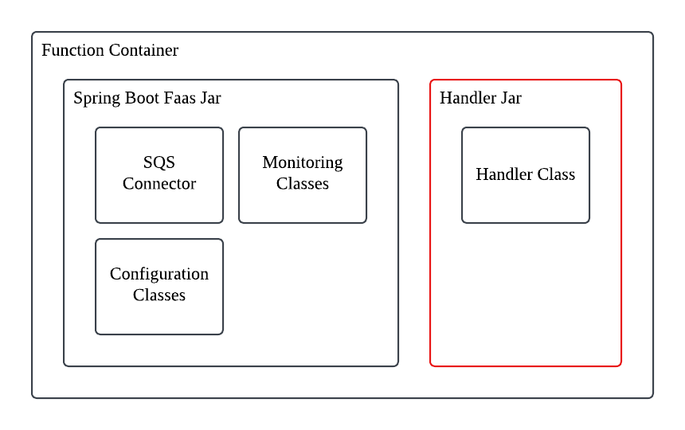

# Spring Boot Faas

A Spring Boot image for wrapping functions written with Spring Boot.



All you need to do is run the `leonpatmore2/spring-boot-faas` image and pass in your function handler as a jar. You can do this in two ways:

- Mount the handler jar inside the image at path `/app/handler/handler.jar`.
- Create a new Docker image from `leonpatmore2/spring-boot-faas`, see [this](./example/Dockerfile) example.

## Usage

### 1: Writing a Function

Implement the `com.leonpatmore.fass.common.Handler` interface.

```kotlin
@Service
class TestHandler : Handler<String> {
    override fun handle(msg: Message<String>): Response {
        LOGGER.info("Hello ${msg.body}!")
        return Response("Hello ${msg.body}!")
    }

    override fun getMessageType(): Class<String> = String::class.java

    companion object {
        private val LOGGER: Logger = LoggerFactory.getLogger(TestHandler::class.java)
    }
}

```

Ensure that this handler is exposed as an auto configured bean.

### 2: Package as a Jar

`./gradlew build`

### 3: Running the Function

Running the function is simple! Simple run the `leonpatmore2/spring-boot-faas` image and inject your function jar to the following path:
`/app/handler/handler.jar`.

```
function:
image: leonpatmore2/spring-boot-faas
ports:
    - "8080:8080"
environment:
    - EVENT_SOURCE_SQS_ENABLED=true
    - SPRING_CLOUD_AWS_REGION_STATIC=us-east-1
    - SPRING_CLOUD_AWS_SQS_ENDPOINT=http://localstack:4566
    - SPRING_CLOUD_AWS_CREDENTIALS_ACCESS_KEY=dummy
    - SPRING_CLOUD_AWS_CREDENTIALS_SECRET_KEY=dummy
    - ROOT_SOURCE_PROPS_QUEUENAME=testQueue
volumes:
    - ../example/build/libs/example-0.0.1-SNAPSHOT-plain.jar:/app/handler/handler.jar
```

#### Properties

The image can run a single function (called a `root` function) or can run multilpe functions.

For running a single function:

- `root.source.factory`: Optional. If unset, there must be exactly on source factory enabled.
- `root.source.props`: Properties passed to the source factory. Check factory for more details.
- `root.target.factory`: Optional. If unset, no event target is used.
- `root.target.props`: Properties passed to the target factory. Check factory for more details.

For running multiple functions:

- `functions.<func_name>.handler`: Required. The handler bean name for this function.
- `functions.<func_name>.source.factory`: Optional. If unset, there must be exactly on source factory enabled.
- `functions.<func_name>.source.props`: Properties passed to the source factory. Check factory for more details.
- `functions.<func_name>.target.factory`: Optional. If unset, no event target is used.
- `functions.<func_name>.target.props`: Properties passed to the target factory. Check factory for more details.

## Example

See [example](example) for a basic example of how to write a function.

## Default Factories

### SQS

#### Source

`event.source.sqs.enabled=true`

Properties:

- `queueName`: Required.

#### Target

`event.target.sqs.enabled=true`

Properties:

- `queueName`: Required.

## Custom Factories

TODO
